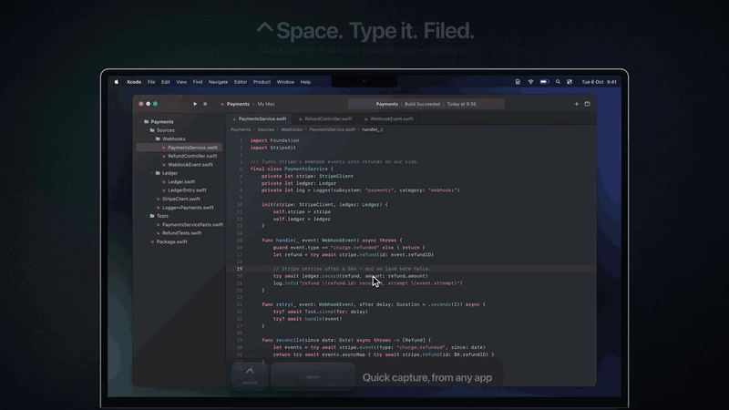

# Notes+

A native Mac notes app for catching project ideas, bugs and tasks before they
evaporate — with a board for every project and an iPhone app that carries the
same notes.

<p align="center">
  
</p>

- **`⌃Space` from any app** opens quick capture. Pick a project, type the note,
  `⌘1`–`⌘4` tags it idea, bug, task or note, `↩` files it — without leaving what
  you were doing.
- **Every project is a board.** Not started, in progress, done — drag a note
  along as the work moves.
- **Code keeps its shape.** Paste a query or a stack trace and it lands in a
  coloured code block; **Prettify** (`⌥⇧⌘F`) tidies it.
- **On your iPhone too**, synced through your own iCloud. No account of ours,
  no telemetry.

The app's source lives in a private repository; this one holds the builds.

## Installing it

Download `Notes+-<version>.dmg` from the [latest release](../../releases/latest),
open it and drag **Notes+** onto **Applications**. Or, with Homebrew:

```bash
brew install --cask spozar/notes-plus/notes-plus
```

Releases are signed with a Developer ID and notarised by Apple, so the app opens
on a double-click. Updates come through the app itself (**Settings → General**).

Requires macOS 14 or later — Apple silicon and Intel.
